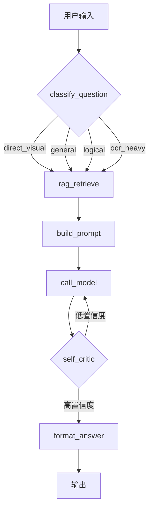

# VQA + RAG · LangGraph 智能问答系统

基于通义千问视觉模型、RAG（检索增强生成）和 **LangGraph StateGraph** 的统一问答系统。
支持**可选**上传图片进行视觉分析，自动检索文档知识库增强回答，具备**自省纠错**重试机制，
集成 **LangSmith** 全链路可观测。

---

## 功能

| 能力 | 说明 |
|------|------|
| 🖼️ **视觉问答** | 上传图片，Qwen-VL 视觉模型分析并回答 |
| 📚 **RAG 知识库** | 上传 PDF/DOCX/TXT 等文档，FAISS 向量检索增强回答 |
| 🔄 **LangGraph 状态图** | 6 节点有向图编排推理流程，支持条件路由与循环 |
| 🧠 **自省纠错** | LLM 自评答案质量，低置信度自动修正重试 |
| 📊 **LangSmith 可观测** | 全链路 tracing，每个节点输入/输出/耗时均可视 |
| 🌙 **深色模式** | 跟随系统自动切换，支持手动切换 |

---

## 架构

### LangGraph 推理流程图



### 核心节点

| 节点 | run_type | 职责 |
|------|----------|------|
| `classify_question` | chain | LLM 分类问题类型（direct_visual / general / logical / ocr_heavy） |
| `rag_retrieve` | chain | FAISS 检索知识库，返回 top-5 相关片段 |
| `build_prompt` | chain | 组装 system prompt，retry 时带修正指令 |
| `call_model` | llm | 调 DashScope API（有图→Qwen-VL，无图→Qwen-Plus） |
| `self_critic` | llm | LLM 自评答案；visual 类型跳过（模型无法看图） |
| `format_answer` | chain | 最终格式化输出 |

---

## 前端页面特性

- **流水线动画** — 提问时实时显示 LangGraph 节点执行进度（🔍→📚→📝→🧠→✅→🎯）
- **答案元信息** — 展示置信度、问题类型、自评结果、修正次数
- **深色模式** — 跟随系统，支持手动切换
- **快捷提问** — 一键模板快速体验
- **知识库管理** — 在线增删文档，实时更新统计
- **响应式** — 桌面和移动端自适应

---

## 快速开始

### 1. 安装依赖

```bash
pip install -r requirements.txt
```

### 2. 配置 API Key

```bash
export DASHSCOPE_API_KEY="your-dashscope-api-key"
```

### 3. 启动服务

```bash
# 方式一：直接运行
python app.py

# 方式二：Uvicorn 显式启动
uvicorn app:app --host 0.0.0.0 --port 5000
```

访问 http://localhost:5000

### 可选：启用 LangSmith 全链路可观测

```bash
export LANGSMITH_API_KEY="your-langsmith-api-key"
# 重启服务后自动生效
```

然后访问 https://smith.langchain.com 选择 `vqa-system` 项目，可以看到每次推理的完整调用树：

```
run_vqa  ──────────────────────────────────  2.3s
 ├─ classify_question [chain] ─────────────  0.3s  ← 可查看 input/output
 ├─ rag_retrieve       [chain] ────────────  0.5s
 ├─ build_prompt       [chain] ────────────  0.01s
 ├─ call_model         [llm]  ─────────────  1.0s  ← token 用量
 ├─ self_critic        [llm]  ─────────────  0.5s
 └─ format_answer      [chain] ────────────  0.01s
```

---

## API 端点

| 方法 | 路径 | 说明 |
|------|------|------|
| GET | `/` | 前端页面 |
| POST | `/ask` | 统一问答（表单，支持图片上传） |
| GET | `/api/graph/visualize` | LangGraph 图结构（JSON） |
| POST | `/api/knowledge/upload` | 上传文档到知识库 |
| GET | `/api/knowledge/docs` | 文档列表 |
| POST | `/api/knowledge/remove` | 删除文档 |
| GET | `/api/knowledge/stats` | 知识库统计 |

---

## 项目结构

```
vqa-system/
├── app.py                 # FastAPI 后端（统一问答 + 知识库 API）
├── app_flask.py           # 原 Flask 版本（备份）
├── vqa_graph.py           # LangGraph 状态图定义（推理引擎核心）
├── rag_manager.py         # RAG 引擎（文档解析 + FAISS 索引 + 检索）
├── embeddings.py          # DashScope Embedding 封装
├── templates/
│   └── index.html         # 统一前端界面（流水线可视化 + 深色模式）
├── static/
│   └── uploads/           # 上传的图片
├── data/
│   ├── docs/              # 上传的文档
│   └── index/             # FAISS 向量索引
├── requirements.txt       # Python 依赖
└── README.md
```

---

## 版本历史

- **v2.1** — 前端流水线可视化 + 深色模式 + LangSmith 全链路 tracing
- **v2.0** — FastAPI + LangGraph 重构，集成自省纠错
- **v1.0** — Flask 版本，基础 VQA + RAG

---

## 许可证

MIT
